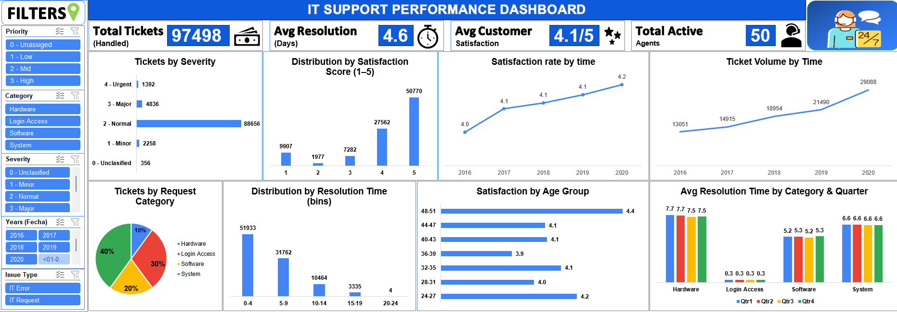

# IT Support Performance Dashboard | Excel Project

An interactive Excel dashboard analyzing **97,498 IT support tickets** to evaluate IT helpdesk performance, agent efficiency, and customer satisfaction.

*Fully interactive Excel Dashboard with slicers for Year, Request Category, Severity, Priority & Issue Type*

## 📊 Key Highlights

• Ticket volume increased by **123%** (13,051 in 2016 → 29,088 in 2020)  
• Average resolution time remained stable at **4.55 days**  
• Login Access tickets resolved in just **0.31 days** ⚡  
• Hardware was the slowest at **7.63 days** (Major Bottleneck)  
• System issues took **6.62 days** on average  
• 50,770 tickets received perfect **5/5** satisfaction rating

## 🛠️ What I Built

- Fully **Interactive Dashboard** with multiple slicers  
- Pivot Tables & Dynamic Charts  
- Year-wise trend analysis  
- Category-wise & Agent-wise performance comparison  
- Satisfaction and Resolution Time distribution  

## 💡 Business Recommendations

**Priority Order:**
1. **Upgrade Ticket Management System** (Highest ROI)  
2. **Targeted Training** for underperforming agents  
3. **Hiring** additional agents (only after software upgrade)

## 🛠️ Skills Demonstrated

- Data Cleaning & Standardization  
- Advanced Pivot Tables & Slicers  
- VLOOKUP  
- Date & String Functions  
- Dashboard Design & Visualization  
- Business Insights & Recommendations

---

**Made by Shivam Gupta**  
Newton School | Excel & Data Analysis Project | March 2026
